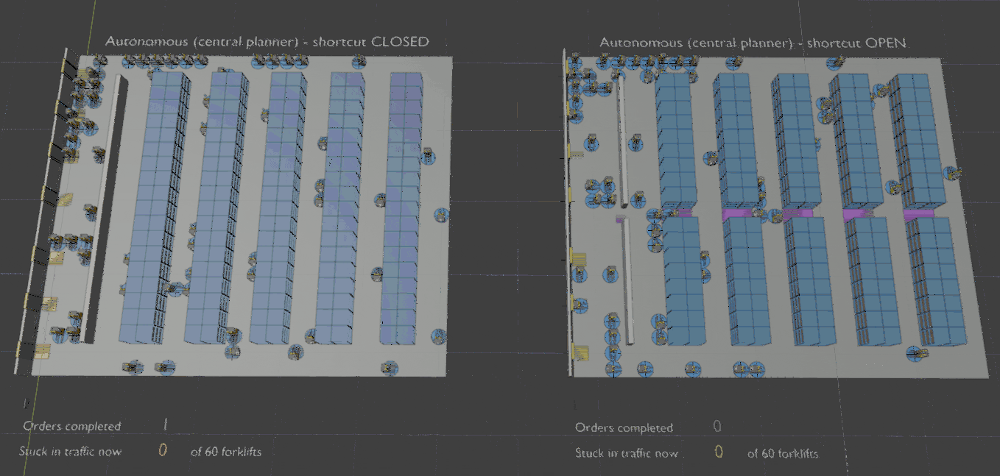
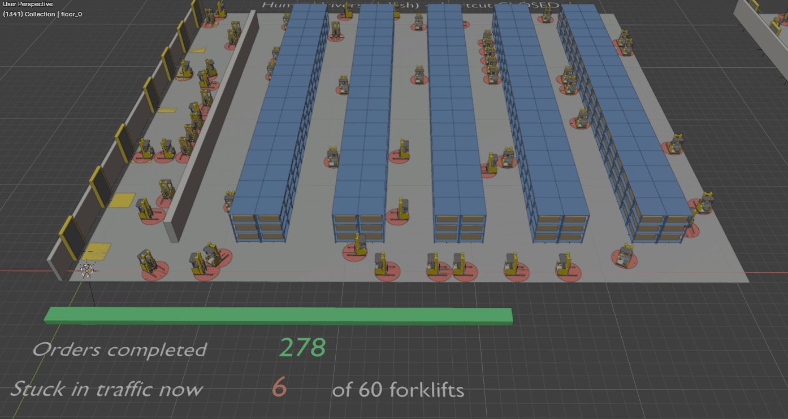
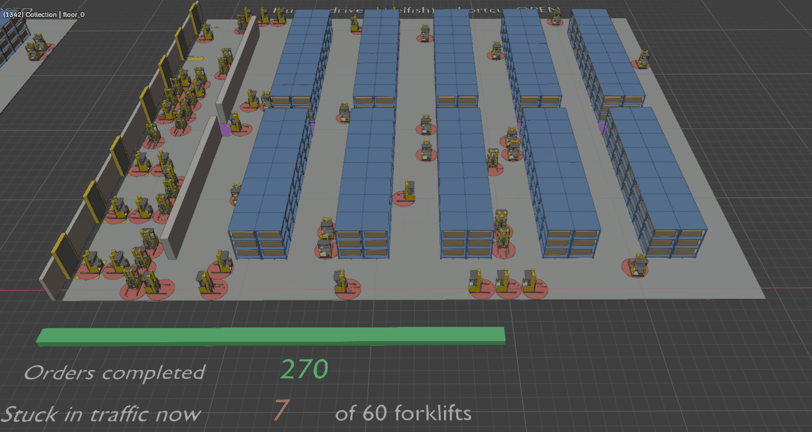

# Warehouse Traffic Simulation

A simulated warehouse environment for studying **forklift traffic, congestion, routing, and operational decision-making**. The project models a warehouse with rack aisles, cross-aisles, loading docks, and forklift traffic. Forklifts receive transport orders and navigate the warehouse while obeying lane and collision constraints.
Originally built to investigate **Braess's paradox** in a warehouse setting: whether adding a seemingly beneficial shortcut can actually increase overall travel time because of congestion.

  

  
  

## Routing strategies

The simulation currently supports several different approaches to routing.

| Fleet         | Routing strategy                                                                                                                                                                          |
| ------------- | ----------------------------------------------------------------------------------------------------------------------------------------------------------------------------------------- |
| `human`       | **Congestion-aware selfish routing.** Each driver estimates travel time from experience and chooses the route that minimizes their own expected travel time.                              |
| `coordinated` | **Centralized planning.** A planner considers the movements of the entire fleet and reserves space through time, allowing it to coordinate vehicles and deliberately wait when necessary. |
| `amr`         | **Shortest-distance baseline.** Vehicles select routes based on distance without accounting for congestion.                                                                               |

